# GitHub Profile Explorer

<div align="center">


</div>

<p align="center">
A native and cross-platform application to explore GitHub profiles and repositories with optimized interfaces for each Apple platform.
</p>

---

## 📑 Contents

- [Features](#-features)
- [Screenshots](#-screenshots)
- [Technologies](#-technologies)
- [Architecture](#-architecture)
- [Project Structure](#-project-structure)
- [Design Patterns](#-design-patterns)
- [Requirements](#-requirements)
- [Installation and Usage](#-installation-and-usage)
- [Tests](#-tests)
- [Implementation Notes](#-implementation-notes)
- [Technical Details](#-technical-details)
- [Author](#-author)
- [Acknowledgments](#-acknowledgments)
- [License](#-license)

## 🚀 Features

- **Cross-platform**: Specific and optimized interfaces for iOS, iPadOS, macOS, visionOS, and tvOS
- **Profile Search**: Quick lookup of GitHub users
- **Data Visualization**: User information (name, photo, bio, location)
- **Repositories**: Detailed list with information (name, description, language)
- **Themes**: Support for dark and light mode
- **Platform-specific features**:
  - **iOS**: Search history, compact design optimized for mobile
  - **iPadOS**: Adaptive layout, optimized SplitView, multitasking
  - **macOS**: Language statistics chart, favorites management
  - **tvOS**: Featured users, navigation adapted to remote control
  - **visionOS**: Immersive experience with 3D elements and visual effects

## 📱 Screenshots

### 📱 iOS

<div align="center">
  <table>
    <tr>
      <td align="center"><b>Search (Light Mode)</b></td>
      <td align="center"><b>Search (Dark Mode)</b></td>
    </tr>
    <tr>
      <td>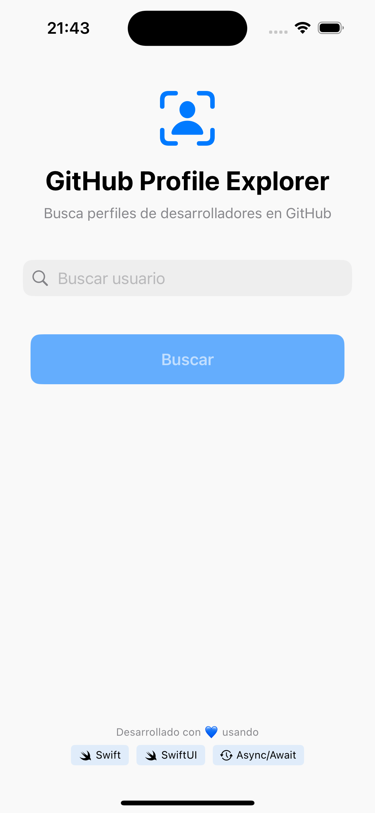</td>
      <td></td>
    </tr>
    <tr>
      <td align="center"><b>Profile (Light Mode)</b></td>
      <td align="center"><b>Profile (Dark Mode)</b></td>
    </tr>
    <tr>
      <td>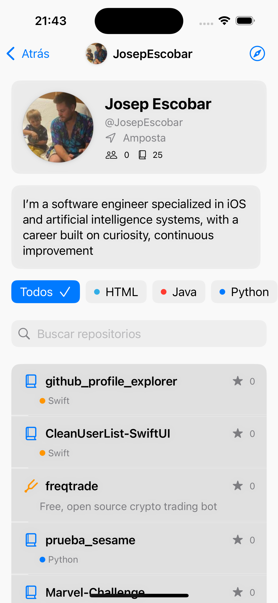</td>
      <td>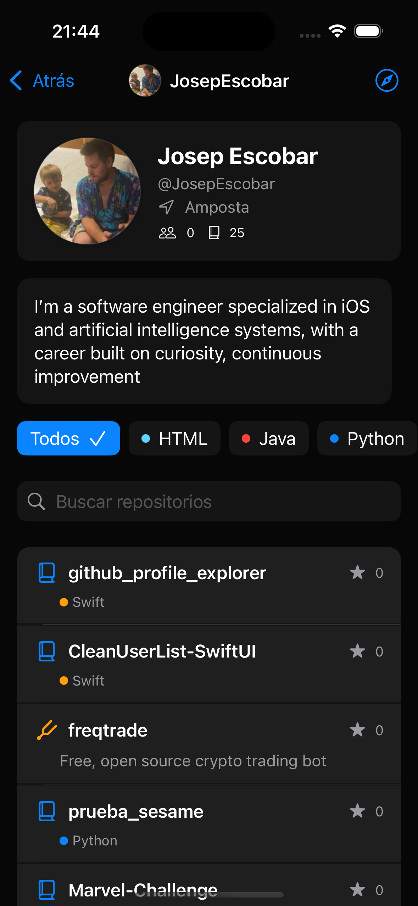</td>
    </tr>
  </table>
</div>

**Key Features:**
* Compact interface optimized for iPhone screens
* Integrated search history for quick access to previously viewed profiles
* Smooth transitions between screens with natural animations
* Full support for dark mode with elegant color palette changes
* Profile view presenting essential developer information and their most popular repositories

### 📱 iPad

<div align="center">
  <table>
    <tr>
      <td>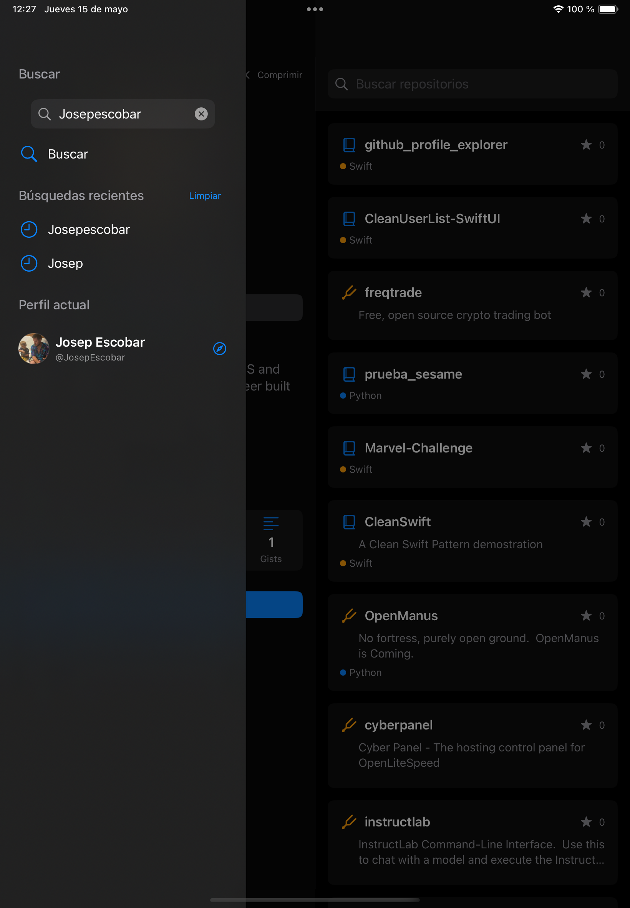</td>
    </tr>
    <tr>
      <td align="center"><b>Sidebar Navigation</b></td>
    </tr>
    <tr>
      <td>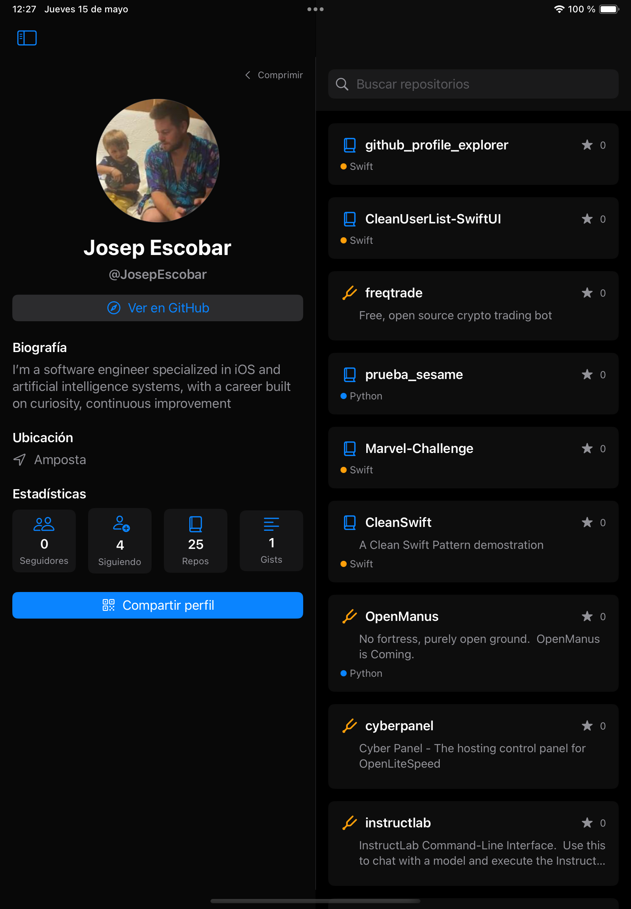</td>
    </tr>
    <tr>
      <td align="center"><b>Profile View (Dark Mode)</b></td>
    </tr>
    <tr>
      <td>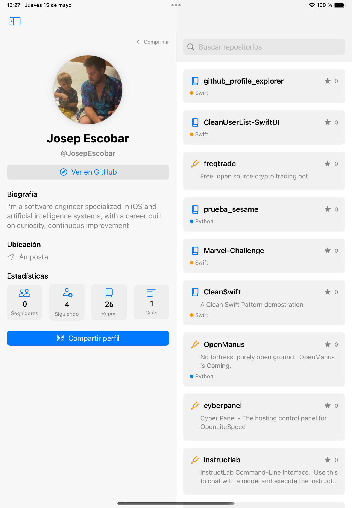</td>
    </tr>
    <tr>
      <td align="center"><b>Profile View (Light Mode)</b></td>
    </tr>
  </table>
</div>

**Key Features:**
* Adaptive design that maximizes the iPad screen space
* Sidebar for quick navigation between profiles and features
* Split view interface that allows viewing lists and details simultaneously
* Optimized for Apple Pencil with enhanced interactive areas
* Support for multitasking with Slide Over and Split View

### 💻 macOS

<div align="center">
  <table>
    <tr>
      <td></td>
    </tr>
    <tr>
      <td align="center"><b>Profile View</b></td>
    </tr>
    <tr>
      <td>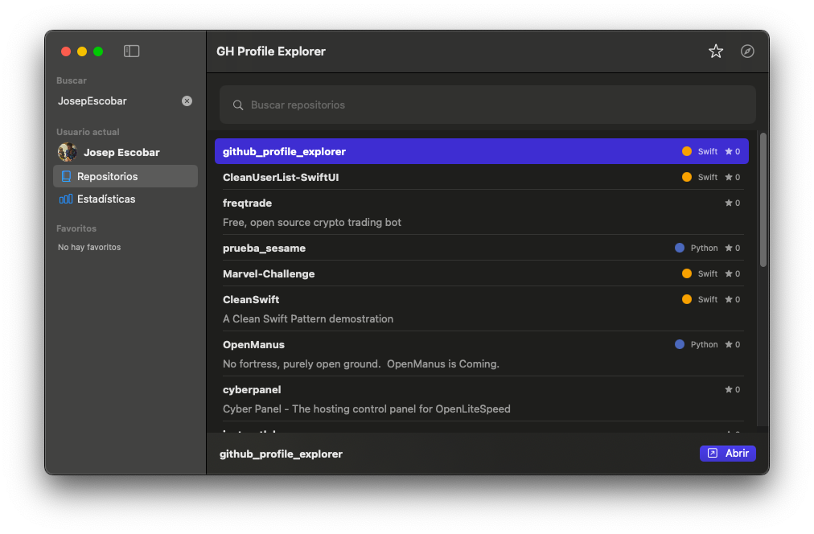</td>
    </tr>
    <tr>
      <td align="center"><b>Repository List</b></td>
    </tr>
    <tr>
      <td>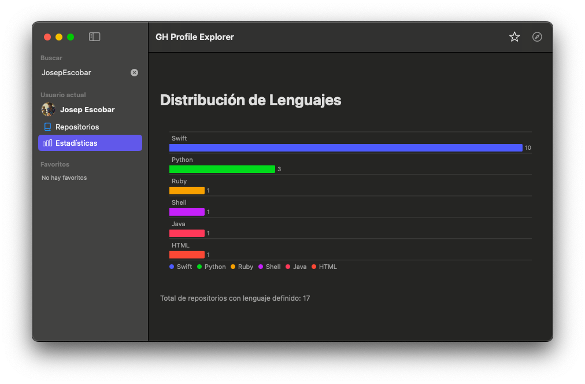</td>
    </tr>
    <tr>
      <td align="center"><b>Language Statistics</b></td>
    </tr>
  </table>
</div>

**Key Features:**
* Native macOS experience with menus, keyboard shortcuts, and native controls
* Advanced statistics visualization with detailed language distribution charts
* Favorites management system for quick access to frequent profiles
* Design adapted to high-resolution displays with intelligent scaling
* Support for drag & drop for advanced content interactions

### 📺 Apple TV

<div align="center">
  <table>
    <tr>
      <td>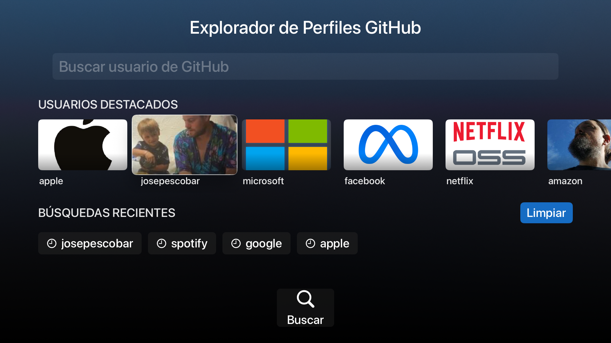</td>
    </tr>
    <tr>
      <td align="center"><b>Home Screen</b></td>
    </tr>
    <tr>
      <td>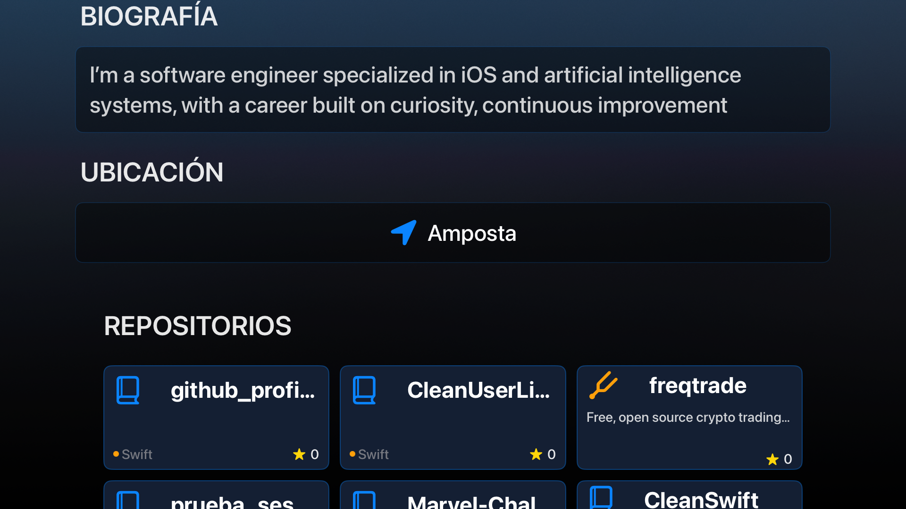</td>
    </tr>
    <tr>
      <td align="center"><b>Repository List</b></td>
    </tr>
    <tr>
      <td>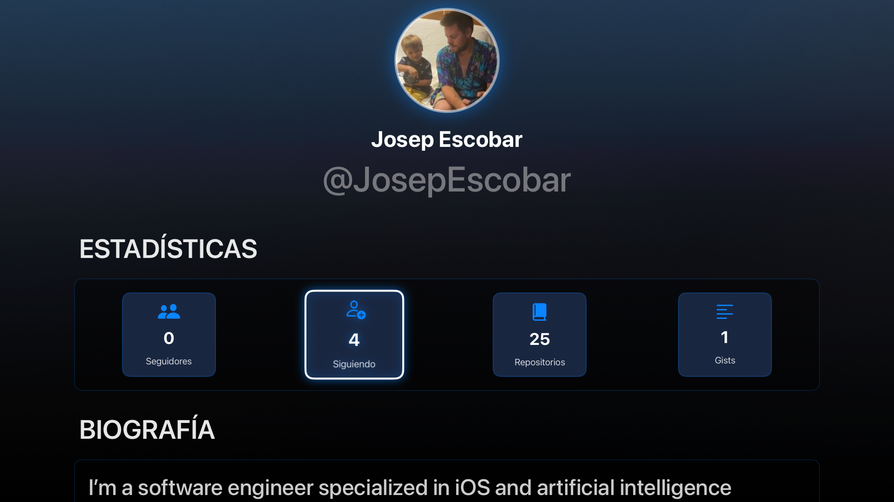</td>
    </tr>
    <tr>
      <td align="center"><b>Profile View</b></td>
    </tr>
  </table>
</div>

**Key Features:**
* Interface optimized for Apple TV remote control with intuitive navigation
* Featured developers and trending repositories
* Cinematic transitions between sections for a fluid experience
* 10-foot design ensuring good readability from a distance
* Presentation mode for displaying profiles on large screens during meetings

### 👓 Apple Vision Pro

<div align="center">
  <table>
    <tr>
      <td>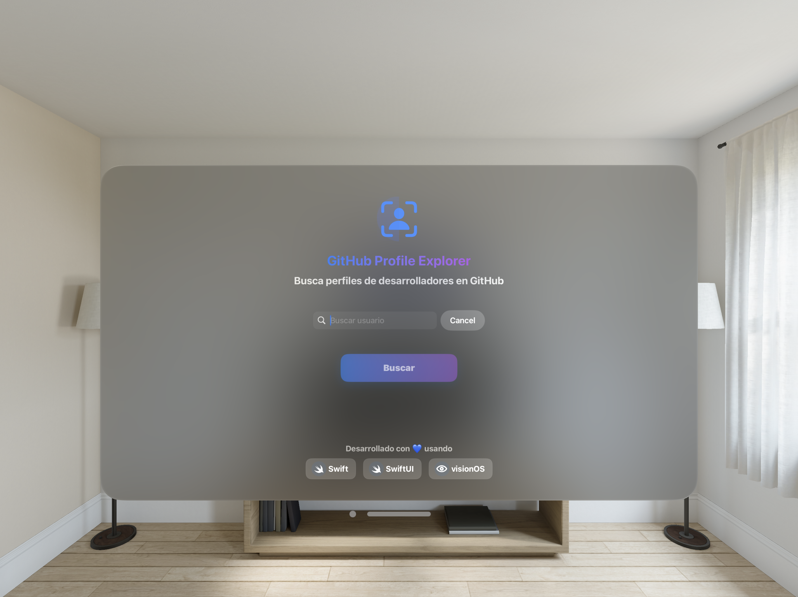</td>
    </tr>
    <tr>
      <td align="center"><b>Immersive Search</b></td>
    </tr>
    <tr>
      <td>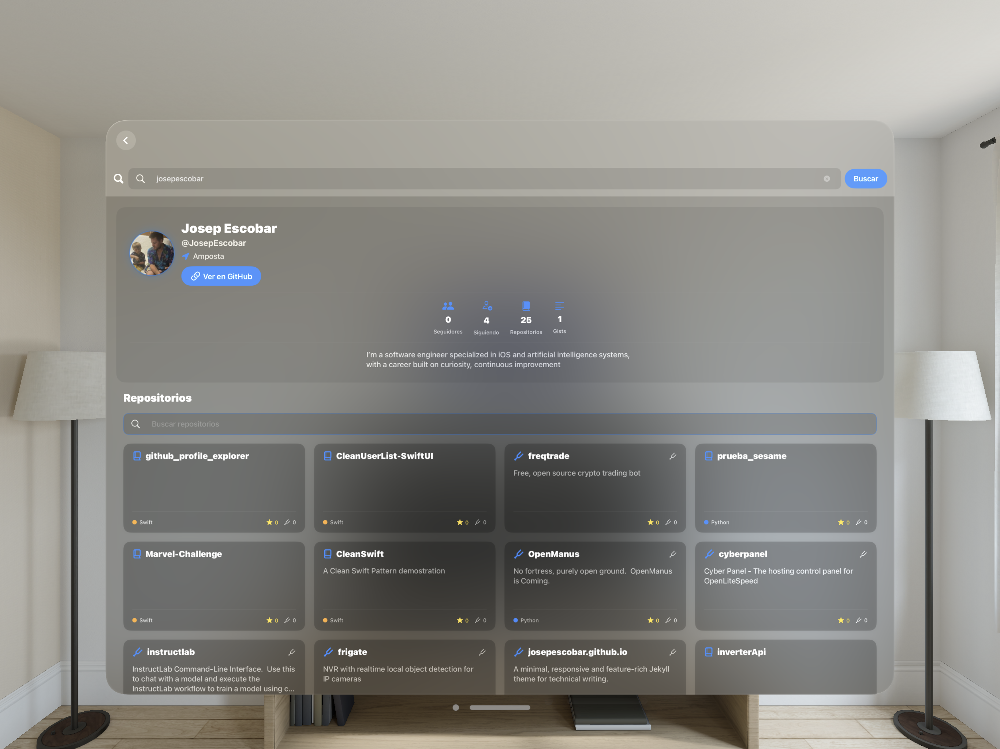</td>
    </tr>
    <tr>
      <td align="center"><b>Profile View</b></td>
    </tr>
    <tr>
      <td>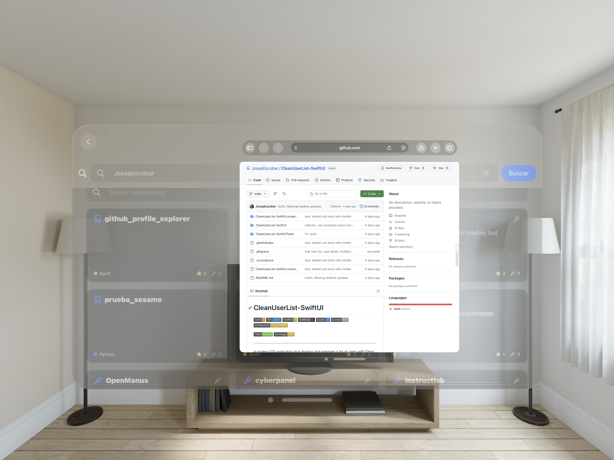</td>
    </tr>
    <tr>
      <td align="center"><b>Repository Detail</b></td>
    </tr>
  </table>
</div>

**Key Features:**
* Immersive experience with 3D elements and advanced visual effects
* Navigation through gestures and integrated eye tracking
* Code visualization with depth and perspective effects
* Dedicated virtual spaces for different profiles and projects
* RealityKit integration to present repositories as explorable three-dimensional structures

## 🧰 Technologies

<table>
  <tr>
    <td><b>Framework</b></td>
    <td><b>Purpose</b></td>
  </tr>
  <tr>
    <td>Swift 6</td>
    <td>Main programming language</td>
  </tr>
  <tr>
    <td>SwiftUI</td>
    <td>Declarative UI framework with platform-specific designs</td>
  </tr>
  <tr>
    <td>Async/await</td>
    <td>Modern asynchronous operations handling</td>
  </tr>
  <tr>
    <td>Kingfisher</td>
    <td>Efficient image loading and caching</td>
  </tr>
  <tr>
    <td>Quick + Nimble</td>
    <td>Testing framework with expressive syntax</td>
  </tr>
  <tr>
    <td>Swift Package Manager</td>
    <td>Dependency and module management</td>
  </tr>
  <tr>
    <td>RealityKit</td>
    <td>Framework for 3D experiences in visionOS</td>
  </tr>
</table>

## 🏗️ Architecture

The project follows a **Clean MVVM Modular** architecture that provides a clear separation of responsibilities and facilitates maintenance and scalability:

### Layers

<table>
  <tr>
    <td><b>Layer</b></td>
    <td><b>Responsibility</b></td>
  </tr>
  <tr>
    <td>Domain</td>
    <td>Business entities, use cases, and repository interfaces</td>
  </tr>
  <tr>
    <td>Data</td>
    <td>Concrete implementations of repositories, networking, and mappers</td>
  </tr>
  <tr>
    <td>Presentation</td>
    <td>Platform-specific ViewModels and Views</td>
  </tr>
  <tr>
    <td>SharedUI</td>
    <td>UI components shared across platforms</td>
  </tr>
</table>

### Principles

- **Modularity**: Layers separated into independent modules
- **Single Responsibility**: Each class has a specific responsibility
- **Dependency Inversion**: Dependencies point towards the domain
- **Framework Independence**: The domain does not depend on external frameworks

## 🏗️ Project Structure

The project organization reflects the modular architecture:

### Domain Layer

The **Domain Layer** is the core of the application, platform and framework independent:

- **Models**: Define the main data structures (`User`, `Repository`, `LanguageStat`, `AppError`)
- **Use Cases**: Implement business logic (`FetchUserUseCase`, `ManageSearchHistoryUseCase`, `FilterRepositoriesUseCase`)
- **Interfaces**: Define protocols for repositories, ensuring a clean separation between logic and data access

### Data Layer

The **Data Layer** manages access to external data:

- **Repositories**: Implement data access logic (`UserRepository`)
- **API**: Contains network infrastructure (`NetworkClient`, `Endpoint`)
- **Mappers**: Convert data between different layers (`UserMapper`, `RepositoryMapper`)

### Presentation Layer

The **Presentation Layer** is divided into platform-specific sublayers:

- **iOS**: Views and ViewModels adapted for mobile devices
- **iPadOS**: Interfaces optimized for tablets with adaptive layouts
- **macOS**: Desktop experience with advanced features
- **tvOS**: Navigation adapted to remote control and large screens
- **visionOS**: Immersive experiences with 3D elements and RealityKit

### SharedUI

Contains reusable UI components and models shared across platforms:

- **Components**: Common views like `SearchBarView`, `AvatarImageView`, and `LoadingView`
- **UIModels**: Shared presentation models
- **ViewModels**: Common presentation logic

## 🔍 Design Patterns

<table>
  <tr>
    <td><b>Pattern</b></td>
    <td><b>Implementation</b></td>
  </tr>
  <tr>
    <td>Repository Pattern</td>
    <td>Abstracts data access and hides API implementation</td>
  </tr>
  <tr>
    <td>Use Case Pattern</td>
    <td>Encapsulates business logic in independent and reusable classes</td>
  </tr>
  <tr>
    <td>MVVM</td>
    <td>Separates presentation logic (ViewModel) from visualization (View)</td>
  </tr>
  <tr>
    <td>Dependency Injection</td>
    <td>Injects dependencies instead of creating them within classes</td>
  </tr>
  <tr>
    <td>Factory Method</td>
    <td>Creates specific instances according to the platform</td>
  </tr>
</table>

## 🛠️ Requirements

- Xcode 15.0+
- Swift 6.0+
- iOS 17.0+
- iPadOS 17.0+
- macOS 14.0+
- tvOS 17.0+
- visionOS 1.0+

## 🚧 Installation and Usage

1. Clone the repository:
   ```bash
   git clone https://github.com/username/github-profile-explorer.git
   ```

2. Open the project in Xcode:
   ```bash
   open "GH Profile Explorer.xcodeproj"
   ```

3. Select the desired scheme (iOS, iPadOS, macOS, tvOS, or visionOS)

4. Build and run the application (⌘+R)

## 🧪 Tests

The project includes a complete test suite with Quick and Nimble:

- **Unit tests** for use cases and business logic, mappers, decoding, etc.


To run the tests:

1. Select the appropriate test scheme
2. Run the tests with ⌘+U

## 📝 Implementation Notes

- **Swift Concurrency**: Use of async/await for asynchronous operations instead of Combine
- **Componentization**: Small and reusable components to maintain clean code
- **Adaptive Design**: Interfaces that adapt to different screen sizes
- **Localization**: Complete localization system to support multiple languages
- **Dark Mode**: Full support for light and dark themes across all platforms

## 🧩 Technical Details

1. **GitHub API**: Uses the public GitHub API (v3)
2. **Image Cache**: Kingfisher for efficient management and asynchronous download
3. **Error handling**: Typed error system and localization for a better user experience
4. **Adaptability**: Platform-optimized interfaces leveraging unique features of each

## 🧑‍💻 Author

**Jose Escobar** - iOS Engineer

## 🙏 Acknowledgments
<br>
<div align="center">

</div>
<br>
This project is the culmination of my 14 years of experience as an iOS Developer. It represents the knowledge, skills, and expertise I've developed throughout my professional career. Every aspect of this application—from architecture to UI design—was personally crafted by me as a demonstration of my capabilities across Apple's platforms.

While this was a solo project, I'd like to acknowledge the resources and technologies that have influenced my development approach over the years:

### Technologies and Libraries

- **[Apple Inc.](https://developer.apple.com)**: For providing SwiftUI, Swift, and the development tools that make it possible to create cross-platform applications with native interfaces for each device. Access to SwiftUI betas and technical support through WWDC, documentation, and sample code were invaluable.

- **[Kingfisher](https://github.com/onevcat/Kingfisher)**: Special thanks to Wei Wang (@onevcat) for creating and maintaining this powerful image downloading and caching library, which significantly improves performance and user experience.

- **[Quick & Nimble](https://github.com/Quick/Quick)**: Thanks to the Quick team for providing a testing framework that makes writing tests more intuitive and expressive.

- **[GitHub API](https://docs.github.com/en/rest)**: For offering a comprehensive and well-documented API that allows access to profile and repository data.

### Inspiration and Design

- Inspired by Apple's human interface design philosophy, which promotes interfaces specifically adapted to each device and form of interaction.

- The design guidelines from ["Design+Code"](https://designcode.io) were fundamental in achieving smooth transitions and a consistent user experience across all platforms.

### Community and Learning

- **[WWDC](https://developer.apple.com/wwdc25)**: Apple's Worldwide Developers Conference is the cornerstone event where the latest Apple technologies are unveiled. This essential gathering provides first-hand access to new frameworks, tools, and design principles.

- **[AppDevCon](https://appdevcon.nl)**: This Amsterdam-based conference brings together developers across mobile platforms, offering deep technical sessions and networking opportunities with European industry leaders.

- **[Swift Heroes](https://swiftheroes.com)**: Held in Turin, Italy, this event focuses exclusively on Swift development with presentations from renowned speakers sharing advanced techniques and case studies.

- **[try! Swift Tokyo](https://tryswift.jp)**: An international conference in Japan that connects Swift developers from across Asia and beyond, featuring diverse perspectives on iOS and Swift development.

- **[Deep Dish Swift](https://deepdishswift.com)**: Chicago's premier Swift conference offers in-depth technical sessions and workshops focusing on practical implementation strategies for complex iOS applications.

- **[iOSKonf](https://ioskonf.mk)**: This growing conference in North Macedonia represents the expanding reach of iOS development in Eastern Europe, with focused content on emerging mobile technologies.

- **[Swift Craft](https://swiftcraft.uk)**: A UK-based event centered on craftsmanship in Swift development, emphasizing best practices, code quality, and sustainable architecture.

- **[SwiftLeeds](https://swiftleeds.co.uk)**: This Leeds conference has quickly become a significant event in the UK Swift community, featuring practical sessions from industry veterans.

- **[Swift Connection](https://swiftconnection.io)**: Paris hosts this networking-focused event that bridges Swift developers across Europe with an emphasis on collaboration and knowledge exchange.

- **[Pragma Conference](https://pragmaconference.com)**: A long-standing Apple development conference in Bologna, Italy, known for high-quality technical content and industry networking.

- **Educational Resources**: The comprehensive materials from [Hacking with Swift](https://www.hackingwithswift.com), [Swift by Sundell](https://www.swiftbysundell.com), and [Point-Free](https://www.pointfree.co) have been instrumental in my approach to implementing modern architectures and effective design patterns.

- **Problem-Solving Networks**: [Stack Overflow](https://stackoverflow.com) and [GitHub Discussions](https://github.com/features/discussions) have provided invaluable technical solutions that have informed development decisions throughout this project.

### Productivity Tools

- **[SwiftLint](https://github.com/realm/SwiftLint)**: Ensures code quality and consistency by enforcing Swift style and conventions, significantly reducing the time spent on code reviews and standardizing the codebase.

- **[SwiftGen](https://github.com/SwiftGen/SwiftGen)**: Generates type-safe code for resources such as images, fonts, and strings, eliminating runtime errors and improving IDE autocomplete support.

- **[XCMetrics](https://github.com/spotify/XCMetrics)**: Collects and analyzes build metrics to optimize compilation times and identify performance bottlenecks in the development workflow.

- **[OpenAI](https://openai.com)**: Leverages advanced AI models for code generation, documentation assistance, and problem-solving, dramatically accelerating development speed and enabling creative solutions to complex challenges.

- **[Anthropic](https://anthropic.com)**: Utilizes Claude AI for nuanced code reviews, architecture planning, and technical documentation, with a focus on creating reliable and maintainable code patterns.

- **[Cursor](https://cursor.sh)**: An AI-enhanced code editor that streamlines development with intelligent code completion, refactoring suggestions, and contextual documentation, significantly enhancing productivity across the entire development lifecycle.

### Resources and References

<br>
<div align="center">

</div>
<br>
- **Technical Articles**: Publications from [objc.io](https://www.objc.io), [NSHipster](https://nshipster.com), and [Swift with Majid](https://swiftwithmajid.com) were invaluable resources for implementing advanced SwiftUI patterns and architecture.

- **Podcasts**: [Swift by Sundell](https://www.swiftbysundell.com/podcast/), [Swift Unwrapped](https://spec.fm/podcasts/swift-unwrapped), and [Inside iOS Dev](https://insideiosdev.com) provided deep insights into development best practices.

- **Open Source Projects**: Architectural inspiration came from studying projects.

- **Books**: "Advanced iOS App Architecture" by Soroush Khanlou and "Swift in Depth" by Tjeerd in 't Veen were crucial references for architectural decisions.

### Special Thanks

A special acknowledgment to the SwiftUI developer community whose work I've followed over the years. The knowledge shared through blogs, videos, and open-source repositories has been instrumental in shaping my own development approach.
<br>
<br>

<div align="center">

</div>
<br>
Finally, this project reflects the culmination of skills acquired throughout my 14-year journey as an iOS developer. From the early days of UIKit to the modern SwiftUI framework, this application demonstrates my ability to leverage Apple's technologies to create seamless, cross-platform experiences on iOS, iPadOS, macOS, tvOS, and visionOS.

## 📄 License

This project is under the MIT License. See the `LICENSE` file for more details. 